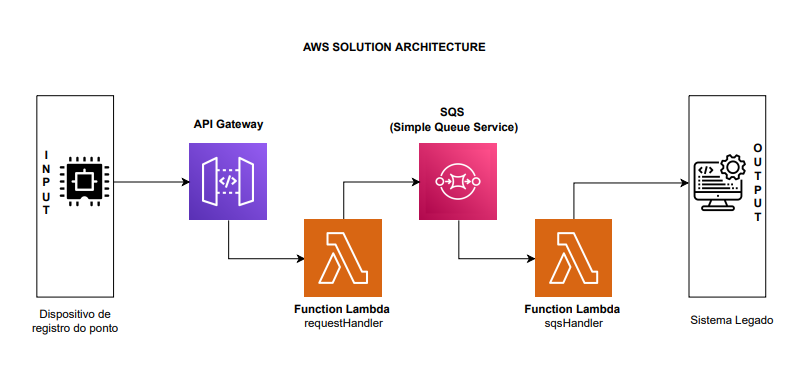

# ChallengeX

## Tutorial
<p> Após clonar o repositório, abra um terminal e configure suas credenciais da AWS.<br>
Em seguida execute os seguintes comandos para instalar algumas dependências do projeto.</p>

``` console
$ npm install -g serverless
$ npm i
$ serverless plugin install -n serverless-vpc-discovery
```
<p>Para subir o ambiente <strong>serveless</strong> para AWS:</p>

``` console
$ sls deploy
```
<p> Para testar a solução você deve acessar a AWS no serviço <a href="https://aws.amazon.com/pt/api-gateway/">API Gateway</a> e fazer login,<br> no menu lateral selecione <strong>Resources</strong>.<br>Expanda até encontrar a rota POST, em seguida escolha o método Test, adicione payload ao Request Body e clique em Test.</p>

<p>IMPORTANTE: Garanta que região na AWS condiz com a descrita no arquivo serverless.yml,</p>

## Arquitetura
